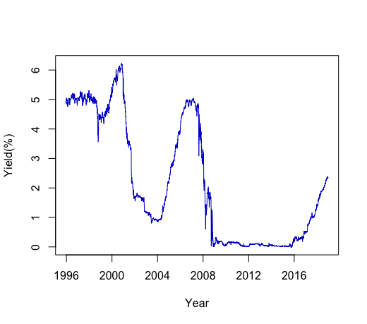
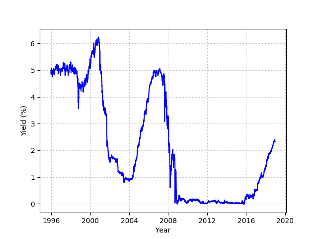

[](http://quantlet.de/)

## [](http://quantlet.de/) **SFEustb** [](http://quantlet.de/)

```yaml

Name of QuantLet : SFEustb

Published in : Statistics of Financial Markets

Description : 'Shows a 3-month U.S. Treasury bill daily yield from 1996 to 2019 as an approximation
of the short rate.'

Keywords : 'approximation, asset, data visualization, financial, graphical representation,
interest-rate, plot, short-rate, time-series, visualization, yield'

See also : SFECIRmle, SFEcir, SFEscomCIR

Author : Guillermo Morishige

Submitted : Mon, January 7 2019

Datafiles : None

Example : Plot of 3-month U.S. Treasury bill daily yield from 1996 to 2019.

```




### R Code:
```r
# clear variables and close windows
rm(list = ls(all = TRUE))
graphics.off()
             
#Get CSV from URL from Federal Reserve Bank of St. Louis
download.file(url='https://fred.stlouisfed.org/graph/fredgraph.csv?bgcolor=%23e1e9f0&chart_type=line&drp=0&fo=open%20sans&graph_bgcolor=%23ffffff&height=450&mode=fred&recession_bars=on&txtcolor=%23444444&ts=12&tts=12&width=1168&nt=0&thu=0&trc=0&show_legend=yes&show_axis_titles=yes&show_tooltip=yes&id=DTB3&scale=left&cosd=1995-12-20&coed=2018-12-21&line_color=%234572a7&link_values=false&line_style=solid&mark_type=none&mw=3&lw=2&ost=-99999&oet=99999&mma=0&fml=a&fq=Daily&fam=avg&fgst=lin&fgsnd=2009-06-01&line_index=1&transformation=lin&vintage_date=2018-12-27&revision_date=2018-12-27&nd=1954-01-04',
              destfile='3monthTB.csv', method='curl')
dataframe = read.csv("3monthTB.csv", header = TRUE)

#Eliminate missing data (represented in file by ".") rows 
df = dataframe[dataframe$DTB3!=".", ]

#Format as dates and numeric
df$DATE = as.Date(df$DATE)
df$DTB3 = as.numeric(levels(df$DTB3))[df$DTB3]

#Plot and insert personalized X axis                    
plot(df$DATE,df$DTB3, type = "l", xlab = "Year", ylab = "Yield(%)", col = "blue3", frame = TRUE, xaxt='n')
axis.Date (1, at = seq(as.Date("1996-01-01"), as.Date("2016-01-01"), by = "+4 year"))


```




### Python Code:
```r
import requests
import pandas as pd
import io
import matplotlib.pyplot as plt

#Get CSV from URL from Federal Reserve Bank of St. Louis and read as Panda series
r=requests.get('https://fred.stlouisfed.org/graph/fredgraph.csv?bgcolor=%23e1e9f0&chart_type=line&drp=0&fo=open%20sans&graph_bgcolor=%23ffffff&height=450&mode=fred&recession_bars=on&txtcolor=%23444444&ts=12&tts=12&width=1168&nt=0&thu=0&trc=0&show_legend=yes&show_axis_titles=yes&show_tooltip=yes&id=DTB3&scale=left&cosd=1995-12-20&coed=2018-12-21&line_color=%234572a7&link_values=false&line_style=solid&mark_type=none&mw=3&lw=2&ost=-99999&oet=99999&mma=0&fml=a&fq=Daily&fam=avg&fgst=lin&fgsnd=2009-06-01&line_index=1&transformation=lin&vintage_date=2018-12-28&revision_date=2018-12-28&nd=1954-01-04')
s = r.content
df = pd.read_csv(io.StringIO(s.decode('utf-8')))

#Eliminate missing data (represented in file by ".") rows
df = df[df.DTB3 != '.' ]

#Format as dates and numeric
df.DATE = pd.to_datetime(df['DATE'], format='%Y-%m-%d')
df.set_index(['DATE'],inplace=True)
df.DTB3 = pd.to_numeric(df['DTB3'])

#Label axes
plt.xlabel('Year')
plt.ylabel('Yield (%)')

#Plot, generate grid, and display plot
plt.plot(df.index,df.DTB3, color='blue')
plt.show()
